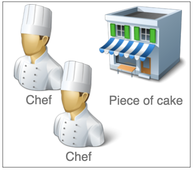
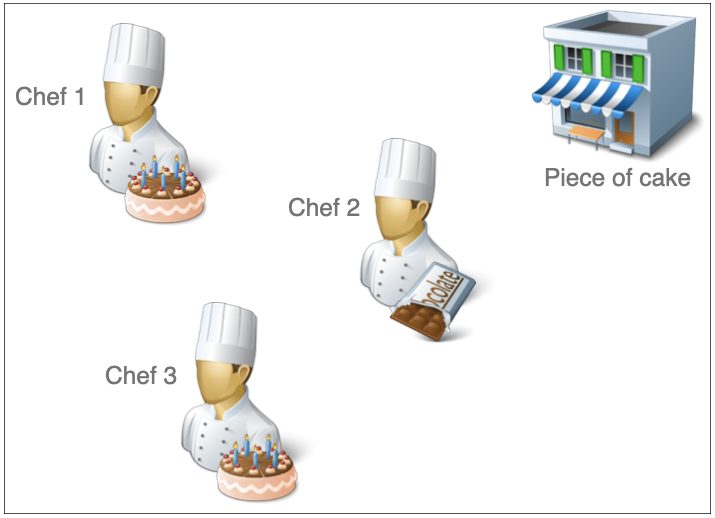
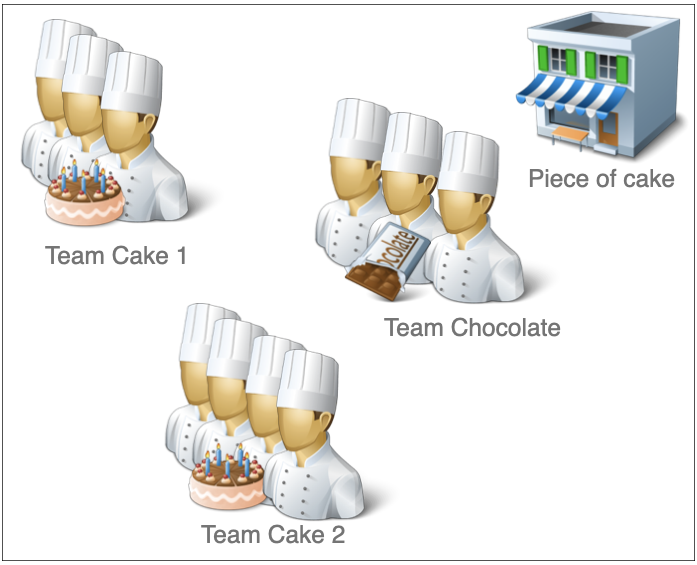
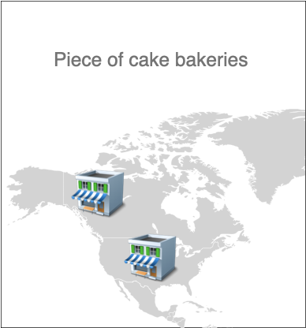
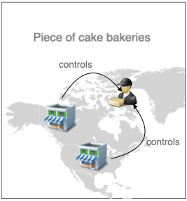
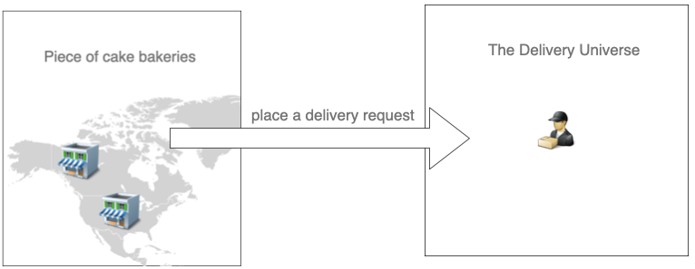

# Exercise: Let's open the best cake bakery in town!

So you start having the bakery called "Piece of cake" and one chef. <br>


After some time it comes to the point that one chef can't handle all the orders of the customers.

**QUESTION 1** How do you handle more orders? <br>
`Ask the chef to optimize his processes. Ask him to work harder, pay him more and his output will rise.`
> _Vertical scaling_: optimize processes and increase throughput with the same resources. <br>
> Preprocessing & Cron jobs: Prepare beforehand at non-peak hours (let's say around 5 a.m.)

Now our business is set up. Great!

---

## Goal: Resilience
This means recovering from failures quickly.<br>
One day your chef is sick so there won't be any business that day.
From now on you hire a backup chef that gets paid for the days the original chef can't work.
The chance of losing business is now very low.



> Backups: Use backups/fallbacks to avoid a single point of failure. 

This now something like a _Master-Slave architecture_ with a master chef and a slave chef.

---

**CHANGE** Business still keeps growing and again you can't handle all the orders. Your backup chef is already working fulltime.

**QUESTION 2** How do you handle more orders? <br>
`You hire more chefs and more backup chefs. Now you have 10 chefs and 3 backups.`
> _Horizontal scaling_: Hire more resources

Great. Your backery works so well, that it is now time for ...


## Goal: Expansion

Just for making it easy to draw: Let's say we have 3 chefs. The specialty of 2 is baking cakes and one's specialty is selfmade chocolate. <br>
 <br>
Specialities in this case means: deliver the product in the same quality but less time.

**QUESTION 3** When receiving on order of 2 cakes, which chefs should be assigned to it? How would you route them? <br>
```
You could assign the order randomly.
But then chef 2 bakes a cake. This is not the efficient way to use your employees. 
Chef 2's specialty is making chocolate. So route all chocolate to chef 2 and all cakes to 1 & 3.
This makes the system simpler and every time the chocolate recipe gets changed only chef 2 has to be notified.
Anytime you need the status of any chocolate order you only have to ask chef 2.
```

## Goal: More throughput
You form whole teams out of specialized chefs.
Let's say we employ 3 chefs for making chocolate (because there are less orders of chocolate than cakes).
Also we employ 7 chefs for baking cakes. Divided in "Team Cake1" with 3 chefs and 4 chefs for "Team Cake2"<br>
 <br>

**QUESTION 3** How is this architecture called where all responsibilities are well defined in one place and there's nothing outside your business usecase you handle.

> Microservice Architecture

At this time the bakery is doing very well because it's able to handle all orders.

---

**CHANGE** A power failure in your bakery prevents your teams from working. So no business for that day.
OR Health office closes your bakery for one day ;-)

## Goal: Distribution 
Open an additional bakery in a different place that bakes cakes and chocolate, too. Maybe it takes more time, maybe the number of chefs is less but at least you have a backup.

**QUESTION 4** This is the biggest step where we introduce a lot of complexity to the system. Why?
```
- you need communication between the bakeries
- you need to route orders (decide which bakery does the job)
```

> Distributed system

If you want an order to be routed to the nearest bakery of a customer this is called a _distributed system with partitioning_

**QUESTION 5** What are further pros of distributed systems? What cons?

```
+ fault tolerant
+ quick response times
- complexity
- higher network load
...
```

## Goal: Global distribution 
In the last stage you get orders from all around the world - you're "bakery-Facebook".<br>


So you've multiple stores (for simplicity just 2), customers (who sits somewhere around the world) and delivery agents per bakery.
Everytime a customer makes an order he has to decide to which bakery actually produces his cake. But a customer should not be responsible for that.
So, you install a "central place" (we call it just for that at the moment) which takes care of routing the incoming requests and receives realtime updates from the bakeries.
You don't just want to send these request randomly because you have a very clear parameter:
How much time does it take till the customer has the cake?

If you send it to bakery 1 it might take
- 1 hour waiting in queue (it's a very popular shop)
- 45 min to do the cake
- 10 min to deliver from bakery 1 to the customer<br>
= Total of 1:55 hours.


If you send it to bakery 2 it might take
-  5 min waiting in queue
- 55 min to do the cake
- 40 min to deliver from bakery 2 to the customer<br>
= Total of 1:40 hours.

So the "Central Place" should route obviously to bakery 2. 
In terms of business decisions more effective routing leads to more money.

If there's a central place that routes in a smart way, this is called ...

> Load balancer

## Goal: Restore clear seperation of concerns
At this point the delivery agent and the bakery have nothing in common.
The delivery agent doesn't care if he delivers cakes or other goods. He only wants to deliver the goods as fast as possible to the customer.<br>
The bakery doesn't care who comes to pick up the cake - the customer or the delivery agent.<br>
So we see some sort of seperated responsibilities between delivery and bakery.

Think of ebay and Paypal: What happend there and how did they develop over time?
```
ebay once programmed his own payment system. But it was bound only to ebay in first place. 
Later it has been seperated and now the operate side by side. On ebay you can pay with 
Paypal like before, but Paypal is now open for any kind of financial business or private transaction.
```

But one thing is missing: Bakeries now manage the bakery stuff **and** the delivery agent stuff. What was that about seperation?<br>


> Decoupling the system. Seperating our concerns that you can handle seperate systems more efficiently.

After taking the control over deliveries from the bakery manger, we now have a delivery manager that plans and controls deliveries on its own.


---

## Goal: Monitor what's going on and learn from the past
Sometimes an oven gets broken or some bikes of the delivery agents are not usable. So delivery times increase. Not good for your business.
At this point you want to log everything. Errors, status of baking, status of delivery, what's the next step and so on.
Also you want to condense these events and interpret them in a useful way. In terms of IT we try to implement analytics, auditing, reporting and machine learning.

> Logging and metrics

## Goal: Extensibility
As a founder you might have ideas about slightly different new business oportunities like "Piece of cake bakeries".
As developer you don't want to rewrite all this code over and over again to solve just a slightly different purpose. 
In our case could be: Our Delivery agent is very used to deliver goods from our bakeries. But actually he's not interested in **what exactly** he delivers, 
he wants to get more flexible and wants to start delivering all sorts of goods.

**QUESTION 7**
Which different companies come to your mind that have done a similar transformation?
- amazon: first only books now IT services
- tesla: started with cars, what is it now? IT? All about electricity?

You could say: Before reaching scalability and extensibility you need to decouple.

**FINALLY** What you just did is called _high level design_. When you start thinking about technologies in practice that's part of _low level design_.

## Key takeaways
tbd

## Glossary
tbd

## Credits
Thanks to the very comprehensible video of [Gaurav Sen](https://www.youtube.com/watch?v=SqcXvc3ZmRU&list=PLMCXHnjXnTnvo6alSjVkgxV-VH6EPyvoX) which was the main inspiration for this excercise.
